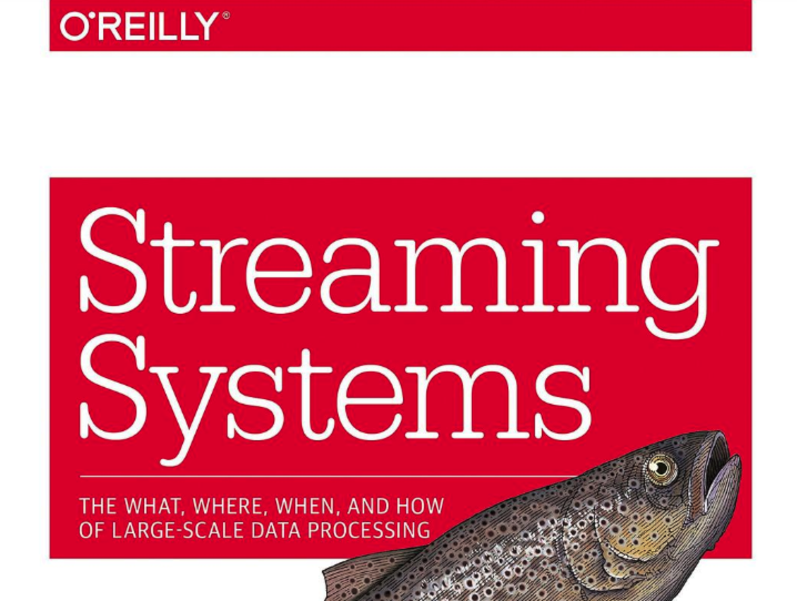

这里给大家推荐的都是我自己看过的 Flink 学习书籍，我会把我认为好的书籍推荐给大家，当然，如果一本书只是将官方文档翻译一遍，我是不会推荐给大家的，因为也没有看的意义。本文将会推荐 Flink 学习的书籍以及论文。

### 1. Flink 学习书籍

#### 1.1 《基于 Apache Flink 的流处理》

这本书主要讲解的 Flink 实时计算引擎相关的知识点，我自己英文版看了两遍，中文版看了一遍，整体感觉还是非常适合新手入门的，里面有很多Flink 相关的技术概念、API 的使用讲解、注意事项等等，这本书的中文版也是最近才上市，本身也是 Flink PMC 编写的，同时也是 Flink Commitor 来进行中文翻译的，Flink 入门，这本书不错。

这本书 Flink 基础讲解的还可以，不过原理方面的话，建议还是去结合源码看会好一些，先知道整体的计算框架，然后再去看源码，这样会更清晰一些。新人如果学习 Flink ，我建议可以从这本书入手。

#### 1.2 《Streaming System》

这本书被称为流式系统的神书，我自己看了一遍，的确在流式系统概念方面讲解的很详细，讲解了流式系统本质就是一个低延迟、但是结果近似的处理系统，也就是说流式系统无法保证100%的准确，一般在4个9或者6个9的精度等等，只要业务方接受即可。

同时这本书也讲解了窗口的类型、WaterMark、Exactly Once等等，不过这本书目前只有英文版的，直接读英文版我觉得还是有一定的难度的，所以，我建议先读完上一本书，在考虑是否要读这本书。你感兴趣可以看一下。

-------------------------------------------

Flink 其他的书籍我也看过，国内也有基本 Flink 相关的书籍，但是我看了一下，感觉很多就是将官网翻译一遍，直接弄到书上，买一本数也挺贵，所以国内的 Flink 书籍，感觉没什么必要看。目前 Flink 相关的书籍我就推荐这两本，以后如果有的话，我会更新上来。

### 2. Flink 学习相关的论文
#### 2.1 《The dataflow model: A practical approach to balancing correctness, latency, and cost in massive-scale, unbounded, out-of-order data processing》
谷歌的数据流模型论文，还没有怎么看，先推荐给大家

### 2.2 《Lightweight Asynchronous Snapshots for Distributed Dataflows》

Flink 内部 Checkpoint 实现的算法，整个 paper 也没有几页，在了解了 Flink 相关概念之后，可以尝试来看一下

----------------------------------------------------------------
> 以上Flink 学习的书籍以及论文，我会持续更新，欢迎关注我的公众号：LakeShen

